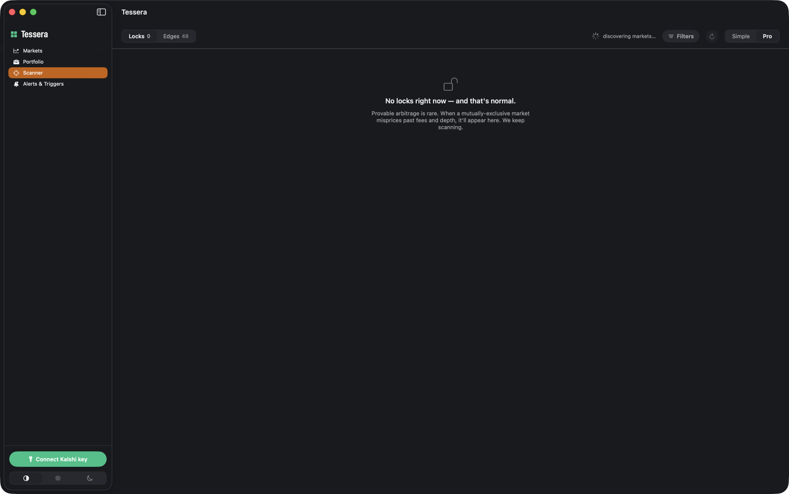
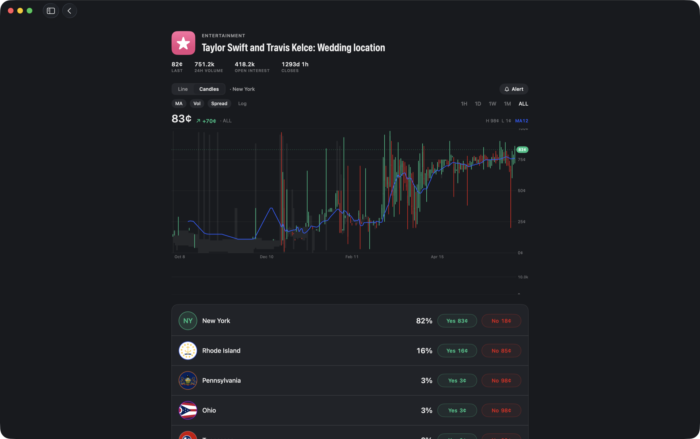

> **Unofficial & not affiliated.** This is an independent, open-source project. It is **not** affiliated with, authorized, endorsed by, or sponsored by Kalshi or KalshiEX LLC. "Kalshi" is used only descriptively to indicate compatibility. See the [Disclaimer](#disclaimer) below and [`DISCLAIMER.md`](DISCLAIMER.md).

<div align="center">


# Tessera + KalshiKit

**A native macOS app and a reusable Swift SDK for [Kalshi](https://kalshi.com), the CFTC-regulated prediction market.**

Browse live markets and implied odds, drill into price history and order books, set price alerts, and — opt-in, with your own API key — place trades. `KalshiKit` is the standalone Swift SDK underneath, usable on its own.

[](https://github.com/IvanKuria/tessera/releases/latest)
[](LICENSE)


[](https://github.com/IvanKuria/tessera/releases)

</div>

> **Unofficial.** Not financial advice. Read-only by default; trading is strictly opt-in and uses **your own** Kalshi API key, stored only in the macOS Keychain.

---

## Screenshots

| Markets dashboard | Market detail |
| --- | --- |
|  |  |
| Live markets across categories with implied probabilities. | Multi-outcome price history, volume, and per-outcome Yes/No pricing. |
| Scanner | Candlestick chart |
|  |  |
| Within-Kalshi mispricing scanner: provable Locks and scored Edges, net of fees and orderbook depth. | Candles + volume, moving average, spread band, log scale, and a hover OHLC crosshair on market detail. |

## What this is

This repository ships **two deliverables**:

| Deliverable | What it is |
| --- | --- |
| **macOS app** (*Tessera*) | A native, windowed desktop client: a markets dashboard, market detail with live price/candlestick charts and order books, a within-Kalshi mispricing **Scanner**, a portfolio view, price **alerts**, and automated **triggers**. Dark mode throughout. Trade execution is opt-in with your own API key. |
| **`KalshiKit`** | An open-source Swift SDK (SwiftPM library) for the Kalshi trade API — market data, websocket, and trading — plus a pure, reusable **Scanner detection engine** (Opportunity model, detectors, fee + VWAP/depth math). Usable on its own — see [`KalshiKit/README.md`](KalshiKit/README.md). |

Both are **free, non-commercial, portfolio projects** released under the **MIT License**.

## Why

- There is **no official native Mac app** for Kalshi; the desktop experience is the website.
- There is a **gap for a reusable Swift SDK** — a clean, typed library other developers can drop into their own macOS/iOS tools.
- Existing read-only menu-bar apps (e.g. PredictBar) cover glanceable odds, so this project's focus is the **reusable SDK** plus a **full-featured client** with detail views, alerts, and actual trade execution.

This is a learning / portfolio project, built in the open.

## Features

- **Markets dashboard** — browse series, events, and markets by category with live implied probabilities and prices, cached to disk for instant cold-launch render.
- **Market detail** — multi-outcome price history (1H / 1D / 1W / 1M / All), 24h volume, open interest, order book, recent trades, and per-outcome Yes/No pricing.
- **Candlestick charts** — a full candlestick suite on market detail: candles + a volume panel, a moving average, a bid/ask spread band, log scale, pinch-to-zoom-at-cursor, a hover crosshair with an OHLC tooltip, a live last-price tick, and set-an-alert-from-the-chart. Toggle between a Line and a Candles view.
- **Scanner** — a within-Kalshi arbitrage and mispricing scanner that proves every opportunity survives **fees and orderbook depth** before it shows it. Two honestly-labeled lanes: **Locks** (provable multi-outcome arbitrage) and **Edges** (scored, not-guaranteed signals). All math is net-of-fee, depth-aware, and annualized against a real hurdle. Real arbitrage is rare, so an empty scanner is the normal, honest state — not a bug. (See [Scanner](#scanner) below.)
- **Portfolio** — balance, open positions, resting orders, recent fills, and settled markets (requires your API key).
- **Alerts** — price/probability thresholds with native notifications.
- **Triggers** — automated rules that can place orders when conditions are met (opt-in, your key).
- **Bring-your-own-key trading** — keys live only in the macOS Keychain and go nowhere except directly to Kalshi.
- **Dark mode** — the whole app follows the system appearance (light/dark).

### Scanner

The Scanner continuously hunts the Kalshi exchange for mispricing and shows only the **net-of-fee, depth-aware, annualized** truth — never a gross price gap. **Honesty is the point**, so its design has hard rails:

- **Locks** are *provable* arbitrage: mutually-exclusive multi-outcome events where buying every outcome costs less than the guaranteed $1 payout, after fees and after walking the real Level-2 book for achievable size.
- **Edges** are *scored, not guaranteed* signals: ladder-monotonicity violations within a series, wide spreads, and stale quotes. They are clearly labeled as estimates, not certainties.
- Every multi-leg opportunity surfaces its **non-atomic legging risk** and worst-case loss — Kalshi has no atomic multi-leg fill, so nothing is ever "guaranteed" at execution.
- A Simple/Pro mode, a dutching calculator clamped to fillable depth, a bound-legs execution panel (gated behind a mandatory legging-risk warning), forward-only **paper trading** (no backtested "you would've made $X"), Watching / Paper P&L / Digest tabs, and opt-in native alerts.

It is **informational only, not financial advice, and not a guarantee of profit.** You are responsible for your own trades. See [`DISCLAIMER.md`](DISCLAIMER.md).

## Install

**No coding required.** Tessera is a signed, notarized macOS app:

1. **[⬇️ Download the latest `Tessera.dmg`](https://github.com/IvanKuria/tessera/releases/latest)** from the Releases page.
2. **Open** the downloaded `.dmg`, then **drag Tessera into your Applications folder**.
3. **Launch Tessera** from Applications (or Launchpad / Spotlight). It's notarized by Apple, so it opens normally — no security workaround needed.

That's it. Requires **macOS 14 (Sonoma) or later**.

- **Browsing needs no account.** Live market data and odds work the moment you open the app.
- **Portfolio & trading are opt-in.** Click **Connect Kalshi key** in the sidebar and paste your own Kalshi API key (key id + RSA private key). It's stored **only in your macOS Keychain** and is never sent anywhere except directly to Kalshi. You can get a key from your Kalshi account settings.

## Build from source (developers)

```sh
brew install xcodegen                 # one-time, if not installed
cd Tessera
xcodegen generate                     # writes Tessera.xcodeproj from project.yml
open Tessera.xcodeproj                 # then Run (⌘R), or build from the CLI:
xcodebuild -scheme Tessera -configuration Debug CODE_SIGNING_ALLOWED=NO build
```

The app launches as a standard windowed Dock app. See [`Tessera/README.md`](Tessera/README.md) for architecture.

### Use the SDK on its own

```swift
import KalshiKit

let client = KalshiClient(environment: .demo)
let markets = try await client.markets(status: "open")
```

See [`KalshiKit/README.md`](KalshiKit/README.md) for the full API surface and authenticated usage.

## Build requirements

- **macOS 14+** (Sonoma or later)
- **Xcode 16+** with **Swift 6** (strict concurrency)
- [XcodeGen](https://github.com/yonaskolb/XcodeGen) (`brew install xcodegen`) for the app target
- Swift Package Manager (no third-party runtime dependencies)

## Repository layout

```
mac-app/
├── Tessera/          # the macOS app (SwiftUI, generated via XcodeGen)
│   └── README.md     # app architecture and build
├── KalshiKit/        # the open-source Swift SDK (SwiftPM package)
│   └── README.md     # SDK usage and API surface
├── docs/screenshots/ # README imagery
├── DISCLAIMER.md     # full disclaimer + pre-release legal checklist
├── NAMING.md         # branding / nominative-fair-use notes
├── LICENSE           # MIT
└── README.md         # you are here
```

## Contributing

Issues and pull requests are welcome. This is an open project — if you find a bug, have a feature idea, or want to extend `KalshiKit`, please open an issue first to discuss. AI-assisted contributions are welcome too: you can open a regular PR (include the prompts you used) or a **prompt request** issue that shares the prompt for review before any code is written.

See [`CONTRIBUTING.md`](CONTRIBUTING.md) for build instructions, architecture, coding conventions, and the PR checklist. By contributing you agree your work is licensed under the project's MIT License.

## License

[MIT](LICENSE). See [`KalshiKit/LICENSE`](KalshiKit/LICENSE) for the SDK (it ships standalone under the same terms).

---

## Disclaimer

- **Not affiliated.** This project is **not** affiliated with, authorized, endorsed by, or sponsored by Kalshi or KalshiEX LLC. No Kalshi logo, wordmark, brand colors, or other trademarks/artwork are used. The name "Kalshi" appears only to describe compatibility (nominative fair use).
- **Informational only — not financial advice.** Any odds, prices, or data shown are for informational purposes only and may be delayed, incomplete, or wrong. Nothing here is financial, investment, legal, or tax advice.
- **AS IS, no warranty.** The software is provided "AS IS", without warranty of any kind. You use it at your own risk. See the [LICENSE](LICENSE).
- **Trading is opt-in and uses your own key.** Read-only features need no credentials. Trade execution is strictly opt-in and requires **your own** Kalshi API key (key id + RSA private key), which is stored **only in the macOS Keychain** and is **never transmitted anywhere except directly to Kalshi**. You are solely responsible for any trades placed.
- **Always verify on Kalshi.** Before acting on anything shown here, confirm it directly on [kalshi.com](https://kalshi.com) or via the official Kalshi API.

The full disclaimer and the pre-release legal checklist live in [`DISCLAIMER.md`](DISCLAIMER.md).
