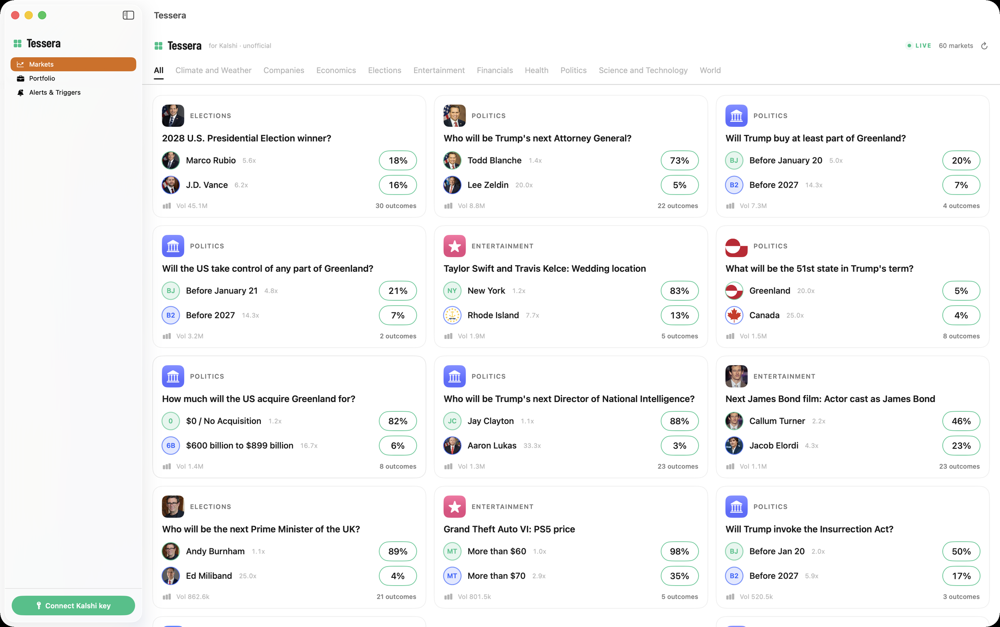
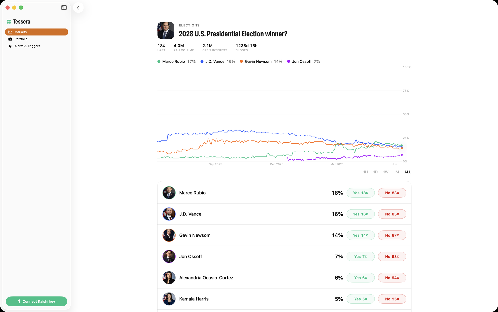

> **Unofficial & not affiliated.** This is an independent, open-source project. It is **not** affiliated with, authorized, endorsed by, or sponsored by Kalshi or KalshiEX LLC. "Kalshi" is used only descriptively to indicate compatibility. See the [Disclaimer](#disclaimer) below and [`DISCLAIMER.md`](DISCLAIMER.md).

<div align="center">

# Tessera + KalshiKit

**A native macOS app and a reusable Swift SDK for [Kalshi](https://kalshi.com), the CFTC-regulated prediction market.**

Browse live markets and implied odds, drill into price history and order books, set price alerts, and — opt-in, with your own API key — place trades. `KalshiKit` is the standalone Swift SDK underneath, usable on its own.

[](LICENSE)


</div>



> **Unofficial.** Not financial advice. Read-only by default; trading is strictly opt-in and uses **your own** Kalshi API key, stored only in the macOS Keychain.

---

## Screenshots

| Markets dashboard | Market detail |
| --- | --- |
|  |  |
| Live markets across categories with implied probabilities. | Multi-outcome price history, volume, and per-outcome Yes/No pricing. |

## What this is

This repository ships **two deliverables**:

| Deliverable | What it is |
| --- | --- |
| **macOS app** (*Tessera*) | A native, windowed desktop client: a markets dashboard, market detail with live price charts and order books, a portfolio view, price **alerts**, and automated **triggers**. Trade execution is opt-in with your own API key. |
| **`KalshiKit`** | An open-source Swift SDK (SwiftPM library) for the Kalshi trade API — market data, websocket, and trading. Reusable on its own — see [`KalshiKit/README.md`](KalshiKit/README.md). |

Both are **free, non-commercial, portfolio projects** released under the **MIT License**.

## Why

- There is **no official native Mac app** for Kalshi; the desktop experience is the website.
- There is a **gap for a reusable Swift SDK** — a clean, typed library other developers can drop into their own macOS/iOS tools.
- Existing read-only menu-bar apps (e.g. PredictBar) cover glanceable odds, so this project's focus is the **reusable SDK** plus a **full-featured client** with detail views, alerts, and actual trade execution.

This is a learning / portfolio project, built in the open.

## Features

- **Markets dashboard** — browse series, events, and markets by category with live implied probabilities and prices, cached to disk for instant cold-launch render.
- **Market detail** — multi-outcome price history (1H / 1D / 1W / 1M / All), 24h volume, open interest, order book, recent trades, and per-outcome Yes/No pricing.
- **Portfolio** — balance, open positions, resting orders, recent fills, and settled markets (requires your API key).
- **Alerts** — price/probability thresholds with native notifications.
- **Triggers** — automated rules that can place orders when conditions are met (opt-in, your key).
- **Bring-your-own-key trading** — keys live only in the macOS Keychain and go nowhere except directly to Kalshi.

## Quick start

Build the app:

```sh
brew install xcodegen                 # one-time, if not installed
cd Tessera
xcodegen generate                     # writes Tessera.xcodeproj from project.yml
open Tessera.xcodeproj                 # then Run (⌘R), or build from the CLI:
xcodebuild -scheme Tessera -configuration Debug CODE_SIGNING_ALLOWED=NO build
```

The app launches as a standard windowed Dock app. Market data is read-only and needs **no credentials**; connect a key only for portfolio and trading. See [`Tessera/README.md`](Tessera/README.md) for architecture.

Use the SDK on its own:

```swift
import KalshiKit

let client = KalshiClient(environment: .demo)
let markets = try await client.markets(status: "open")
```

See [`KalshiKit/README.md`](KalshiKit/README.md) for the full API surface and authenticated usage.

## Build requirements

- **macOS 14+** (Sonoma or later)
- **Xcode 16+** with **Swift 6** (strict concurrency)
- [XcodeGen](https://github.com/yonaskolb/XcodeGen) (`brew install xcodegen`) for the app target
- Swift Package Manager (no third-party runtime dependencies)

## Repository layout

```
mac-app/
├── Tessera/          # the macOS app (SwiftUI, generated via XcodeGen)
│   └── README.md     # app architecture and build
├── KalshiKit/        # the open-source Swift SDK (SwiftPM package)
│   └── README.md     # SDK usage and API surface
├── docs/screenshots/ # README imagery
├── DISCLAIMER.md     # full disclaimer + pre-release legal checklist
├── NAMING.md         # branding / nominative-fair-use notes
├── LICENSE           # MIT
└── README.md         # you are here
```

## Contributing

Issues and pull requests are welcome. This is an open project — if you find a bug, have a feature idea, or want to extend `KalshiKit`, please open an issue first to discuss. By contributing you agree your work is licensed under the project's MIT License.

## License

[MIT](LICENSE). See [`KalshiKit/LICENSE`](KalshiKit/LICENSE) for the SDK (it ships standalone under the same terms).

---

## Disclaimer

- **Not affiliated.** This project is **not** affiliated with, authorized, endorsed by, or sponsored by Kalshi or KalshiEX LLC. No Kalshi logo, wordmark, brand colors, or other trademarks/artwork are used. The name "Kalshi" appears only to describe compatibility (nominative fair use).
- **Informational only — not financial advice.** Any odds, prices, or data shown are for informational purposes only and may be delayed, incomplete, or wrong. Nothing here is financial, investment, legal, or tax advice.
- **AS IS, no warranty.** The software is provided "AS IS", without warranty of any kind. You use it at your own risk. See the [LICENSE](LICENSE).
- **Trading is opt-in and uses your own key.** Read-only features need no credentials. Trade execution is strictly opt-in and requires **your own** Kalshi API key (key id + RSA private key), which is stored **only in the macOS Keychain** and is **never transmitted anywhere except directly to Kalshi**. You are solely responsible for any trades placed.
- **Always verify on Kalshi.** Before acting on anything shown here, confirm it directly on [kalshi.com](https://kalshi.com) or via the official Kalshi API.

The full disclaimer and the pre-release legal checklist live in [`DISCLAIMER.md`](DISCLAIMER.md).
